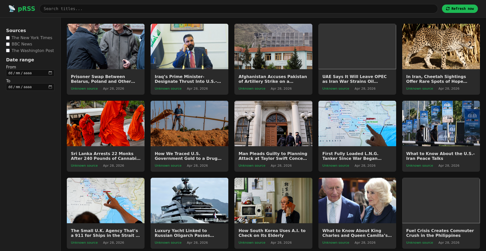

# 📡 pRSS

> A self-hosted RSS news aggregator with a simple interface.

pRSS fetches articles from your favourite RSS feeds, stores them locally, and presents them in a clean  dashboard. Filter by source, search by title.



## Features

- **Automatic background refresh** – feeds update every 30 minutes without you touching anything.
- **Instant search & filters** – find articles by keyword, feed, or date range.
- **Dark‑mode only** – designed for low eye strain.
- **Zero‑compilation frontend** – Alpine.js and vanilla CSS.

## Tech Stack

| Layer    | Technology                          |
|----------|-------------------------------------|
| Backend  | FastAPI + SQLAlchemy + SQLite       |
| Frontend | HTML5, CSS3, Alpine.js              |
| RSS parsing | feedparser                      |
| Scheduling | APScheduler                     |

## Getting Started

### Prerequisites

- Python 3.10 or higher
- [uv](https://github.com/astral-sh/uv) 

### Installation

```bash
# Clone the repository
git clone https://github.com/maxmprado/pRSS.git
cd pRSS

# Install dependencies with uv
uv sync
uv run uvicorn backend.main:app --reload
```


### Adding your first feed

1. Go to **/docs** for the interactive API documentation.

2. Use the **POST /api/feeds** endpoint to add a feed URL.
   - `name` → a display name (e.g. “BBC News”)
   - `url` → the RSS feed URL (e.g. `http://feeds.bbci.co.uk/news/rss.xml`)

3. The scheduler will fetch articles automatically, or you can click **Refresh now** in the UI.

## API

Key endpoints:

- `GET /api/feeds` – list all feeds
- `POST /api/feeds` – add a new feed
- `GET /api/articles` – list articles (with filtering & pagination)
- `GET /api/articles/{id}` – get a single article
- `POST /api/refresh` – trigger an immediate refresh of all feeds


### Project Structure

```bash
RSS/
├── backend/
│   ├── main.py            # FastAPI app entry point
│   ├── database.py        # Database connection & session
│   ├── models.py          # SQLAlchemy models (Feed, Article)
│   ├── schemas.py         # Pydantic schemas
│   ├── rss_fetcher.py     # RSS download & parsing
│   ├── crud.py            # Database operations
│   ├── tasks.py           # Scheduled refresh logic
│   └── routers/
│       ├── feeds.py
│       ├── articles.py
│       └── refresh.py
├── frontend/
│   ├── index.html         # Single-page application
│   ├── css/style.css      # Dark theme styles
│   ├── js/app.js          # Alpine.js component logic
│   └── assets/
└── pyproject.toml
```


### License

MIT – see the 

  
